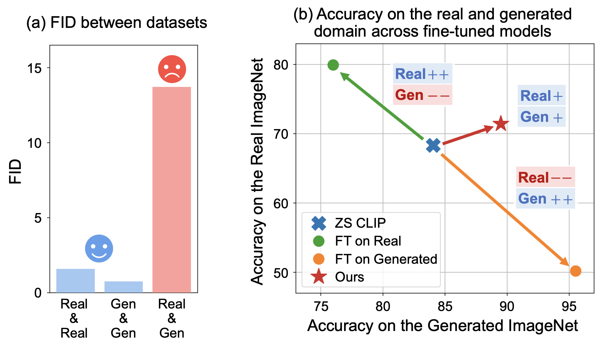

# Regularized Training with Generated Datasets for Name-Only Transfer of Vision-Language Models

[](https://arxiv.org/abs/2406.05432)

[Minho Park](https://pmh9960.github.io/), [Sunghyun Park](https://psh01087.github.io/), [Jooyeol Yun](https://yeolj00.github.io/), and [Jaegul Choo](https://sites.google.com/site/jaegulchoo/)  
Korea Advanced Institute of Science and Technology (KAIST)

> TLDR; To effectively fine-tune CLIP with the generated datasets, robust regularization techniques are essential, including weight-space ensembling and variance-covariance regularization.

<p align="center"></p>

> (a) Observed significant domain gap and (b) Performance degradation due to the domain gap.

## Installation

```bash
# python=3.8, torch==2.0.0, etc.
conda env create --file environments.yaml
conda activate regft
```

## Generating classification dataset

```bash
cd 1_generate_datasets
python generate_datasets.py --ckpt="stabilityai/stable-diffusion-2-1-base" --dataset="imagenet" --prompt_style_file="prompt_styles.json" --output_dir="/path/to/save/generated_imagenet"
```

## Finetuning CLIP with the generated dataset

- Training-time regularization (Variance-Covariance Regularization)
- Post-training regularization (Weight-space ensemble)

```bash
cd 2_finetune_classifier
export PYTHONPATH="$PYTHONPATH:${PWD}"

vc_reg1=0.16
vc_reg2=0.02
model="ViT-B/16"
eval_dataset="ImageNet"
train_dataset="ImageNetSD"
gpt_prompt_file="gpt_file/imagenet_prompt.json"
save_subdir="/path/to/save"

python train.py --train-dataset=${train_dataset} --model=${model} --eval-datasets=${eval_dataset} --alpha 0 0.1 0.2 0.3 0.4 0.5 0.6 0.7 0.8 0.9 1.0 --gpt_prompt_file gpt_file/imagenet_prompt.json --vc_reg ${vc_reg1} ${vc_reg2} --save=${save_subdir}
```

## (Optional) Integration with the adapter method

- Replace the image encoder in the [CaFo](https://github.com/OpenGVLab/CaFo) architecture with the fine-tuned version.

## Acknowledgement

This repo benefits from [diffusers](https://github.com/huggingface/diffusers), [CLIP](https://github.com/openai/CLIP), [WiSE-FT](https://github.com/mlfoundations/wise-ft), and [CaFo](https://github.com/OpenGVLab/CaFo). Thanks for their wonderful works.

## Citation

```bibtex
@article{park2024regularized,
  title={Regularized Training with Generated Datasets for Name-Only Transfer of Vision-Language Models},
  author={Park, Minho and Park, Sunghyun and Yun, Jooyeol and Choo, Jaegul},
  journal={arXiv preprint arXiv:2406.05432},
  year={2024}
}
```